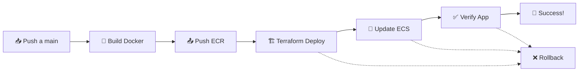

# 🚀 PIPELINE CI/CD AMRIZE - GUÍA COMPLETA

## 📋 ¿Qué hemos creado?

Hemos transformado el script `deploy-to-ecr.sh` en un **pipeline completo de CI/CD** que automatiza todo el proceso de despliegue desde GitHub hacia AWS.

### 🔄 Flujo del Pipeline



## 🎯 Ventajas sobre el script original

| **Antes (deploy-to-ecr.sh)** | **Ahora (Pipeline GitHub)** |
|-------------------------------|------------------------------|
| ❌ Manual execution | ✅ Automatic on push |
| ❌ Local dependencies | ✅ Cloud-based execution |
| ❌ No rollback | ✅ Automatic rollback |
| ❌ No verification | ✅ Health checks |
| ❌ Single step failure = manual recovery | ✅ Step-by-step error handling |
| ❌ No infrastructure update | ✅ Infrastructure as Code |

## 🛠️ Componentes del Pipeline

### 1. 🚀 **Build & Push Docker Image to ECR**
- **Basado en**: `deploy-to-ecr.sh` lines 13-29
- **Mejoras**: 
  - Validación de repositorio ECR
  - Múltiples tags (SHA + latest)
  - Cleanup automático
  - Emojis y logs mejorados

```yaml
# Original script logic:
aws ecr get-login-password | docker login
docker build -t image:latest .
docker tag image:latest $ECR_URI:latest  
docker push $ECR_URI:latest

# Pipeline enhancement:
✅ Repository validation
✅ Multi-tag strategy
✅ Output variables for next jobs
✅ Automatic cleanup
```

### 2. 🏗️ **Terraform Infrastructure Deployment**
- **Nueva funcionalidad**: No existía en el script original
- **Beneficios**:
  - Infraestructura versionada
  - Plan preview en PRs
  - State management
  - Rollback capability

### 3. 🔄 **Update ECS Service**
- **Basado en**: Comentario en `deploy-to-ecr.sh` line 30
- **Mejoras**:
  - Forzar nueva deployment
  - Wait for stability
  - Service health verification

### 4. ✅ **Verify Deployment**
- **Nueva funcionalidad**: No existía validación
- **Beneficios**:
  - Health checks automáticos
  - Exponential backoff
  - Debugging information
  - Final validation

### 5. 🧹 **Cleanup on Failure**
- **Nueva funcionalidad**: Manejo de errores
- **Beneficios**:
  - Rollback automático
  - Cleanup de recursos fallidos
  - Notificaciones de fallo

## 📁 Archivos Creados/Modificados

### ✅ Nuevos Archivos:
- `.github/workflows/terraform.yaml` - **Pipeline principal**
- `setup-github-secrets.sh` - Configuración de secretos
- `test-pipeline.sh` - Testing pre-deploy
- `PIPELINE-README.md` - Documentación completa

### 🔄 Mejorados:
- `deploy-to-ecr.sh` - Mantiene funcionalidad original para testing local

## 🎮 Comandos de Uso

### 🚀 **Activar Pipeline** (Reemplaza al script manual)
```bash
# Antes:
./deploy-to-ecr.sh

# Ahora:
git add .
git commit -m "deploy: nueva versión"
git push origin main
# ¡El pipeline se ejecuta automáticamente!
```

### 🔧 **Configurar Secretos**
```bash
./setup-github-secrets.sh
```

### 🧪 **Testing Local**
```bash
./test-pipeline.sh
```

## 📊 Comparison: Script vs Pipeline

### Script Original (deploy-to-ecr.sh)
```bash
#!/bin/bash
set -e

AWS_REGION="us-east-1"
ECR_REPOSITORY="amrize-ecr-repo"
IMAGE_TAG="latest"

echo "🚀 Iniciando despliegue a ECR..."
ECR_URI=$(aws ecr describe-repositories...)
aws ecr get-login-password | docker login...
docker build -t $ECR_REPOSITORY:$IMAGE_TAG .
docker tag $ECR_REPOSITORY:$IMAGE_TAG $ECR_URI:$IMAGE_TAG
docker push $ECR_URI:$IMAGE_TAG
echo "✅ ¡Imagen desplegada exitosamente!"
```

### Pipeline Equivalent
```yaml
docker_build_push:
  steps:
    - name: 📋 Get ECR Repository Info
    - name: 🔐 Login to Amazon ECR  
    - name: 🔨 Build, Tag & Push Docker Image
    - name: 🧹 Cleanup Local Images

terraform_deploy:
  steps:
    - name: 🔄 Update ECS Task Definition
    - name: 🚀 Terraform Apply

ecs_update:
  steps:
    - name: 🔄 Force ECS Service Update
    - name: ⏳ Wait for Service Stability

verify_deployment:
  steps:
    - name: 🌐 Test Application Endpoint
    - name: 🏥 Health Check Summary
```

## 🎯 Beneficios Clave

### 🔄 **Automatización Completa**
- **Antes**: 5 comandos manuales + verificación manual
- **Ahora**: 1 push = despliegue completo automatizado

### 🛡️ **Robustez**
- **Antes**: Si algo falla, recovery manual
- **Ahora**: Rollback automático + notificaciones

### 👥 **Colaboración**
- **Antes**: Solo quien tiene el script puede desplegar
- **Ahora**: Cualquier desarrollador puede hacer push

### 📈 **Escalabilidad**
- **Antes**: Un ambiente, un script
- **Ahora**: Múltiples ambientes con branches

### 🔍 **Visibilidad**
- **Antes**: Logs locales únicamente
- **Ahora**: Logs en GitHub + AWS CloudWatch

## 🚀 Próximos Pasos

1. **Configurar secretos**: `./setup-github-secrets.sh`
2. **Hacer push**: El pipeline se activará automáticamente
3. **Monitorear**: Ver el progreso en GitHub Actions
4. **Verificar**: La aplicación estará disponible en el ALB URL

## 🎉 Resultado Final

Has pasado de tener un **script manual** a un **pipeline profesional de CI/CD** que:

- ✅ Se ejecuta automáticamente
- ✅ Maneja errores inteligentemente  
- ✅ Hace rollback si algo falla
- ✅ Verifica que todo funcione
- ✅ Notifica el resultado
- ✅ Escala para equipos grandes
- ✅ Mantiene historial de despliegues

**¡El pipeline está listo para producción!** 🚀
